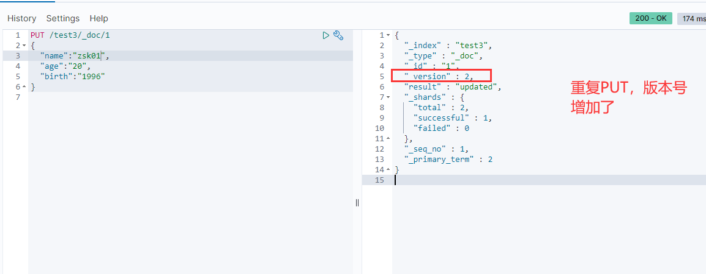

# ElasticSearchDemo #
- ElasticSearch入门级配置的介绍
     

## 1 安装相关工具 ##
### 1.1 安装elasticsearch ###
    a. 下载地址：https://www.elastic.co/cn/downloads/elasticsearch
    b. 本次是使用的window环境测试的（linux的安装方法，自行查询下吧），下载后解压，如下图

    c. 解压后启动：进到解压后的目录》》》选择bin文件夹》》》找到elasticsearch.bat文件，点击启动。

### 1.2 安装ik分词器 ###
#### 1.2.1 分词器作用 ####
    通俗点讲就是把输入的内容，按照一定的规则拆分成多个组合的词汇，通过这个词汇再去匹配。
    例如在百度搜索时，会有全匹配的，部分匹配的。而部分匹配的就是通过分词器拆分了搜索词条，进行的搜索。

    a. 下载地址：https://github.com/medcl/elasticsearch-analysis-ik/releases
    
    b. 下载后解压，我这里对文件夹更名为：analysis-ik 将文件夹放到es目录》》》plugins目录下。
    
    c. 重启es，查看启动日志时有加载到ik的日志信息，如下图
    

### 1.3 安装elasticsearch-head ###

### 1.4 安装kibana ###

## 2 使用ik分词器 ##

### 2.1 分词方式 ###

### 2.2 自定义词库 ###

## 3 使用kibana操作es ##
    下面的命令都是基于Rest风格的
    

### 3.1 创建索引 ###
#### 3.1.1创建 ####
    命令简介：
    put /索引名/~类型名~/文档id
    {请求体}
**_注意：类型名，在后期的版本中会删除掉，这里可以不用写类型名，默认会有一个`_doc`的类型_**
 
**_注意: PUT 用大写，不然工具会有一个叉号，但是我执行也成功了。大小写的问题还没有详细查询，尽量还是用大写吧。_**

#### 3.1.2 创建结果 #####
1. 在es-head里面查看，已经多了一个索引

2. 在es-head里面查看数据

### 3.2 创建索引，指定字段类型 ###
#### 3.2.1 创建索引，指定字段类型 ####

1. 创建一个索引，设置类型（此时没有往里面放数据）。（有点像数据库，新建一个表，设置字段类型，还没有放数据）

2. 查看es-head，发现多了一个test2的索引

#### 3.2.2 获取索引信息 ####
- 直接使用GET 命令

### 3.3 默认类型 ###
#### 3.3.1 创建一个索引 ####

1. 创建

2. 结果

3. 查看默认的数据类型
- 如果文档字段没有指定，es会默认配置字段类型

4. 扩展
    通过命令 elasticsearch 索引情况！
    通过get _cat/ 可以获得es的当前很多的信息

### 3.4 修改值###
#### 3.4.1 #####
 a. 使用put，可以直接覆盖原来的结果。如下图
 _**注意：这种修改数据的情况是对原来数据的覆盖，如果覆盖的时候某个字段忘了写值了，就直接为空了_**

b. 通过post修改，如下图

### 3.5 删除 ###

- 然后查看es-head里面，test1已经被删除了

- 通过delete 命令实现删除，根据请求判断删除索引（例如：DELETE test1），或者删除某个文档（例如：DELETE test1/_doc/1）

## 4 springboot集成es ##
